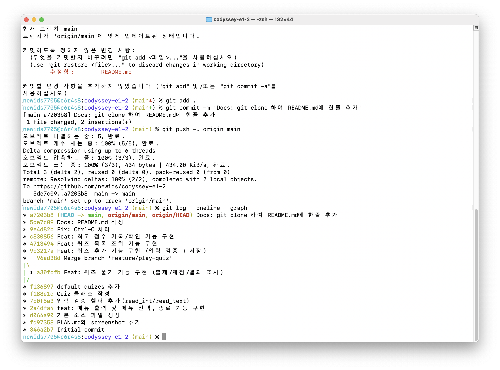
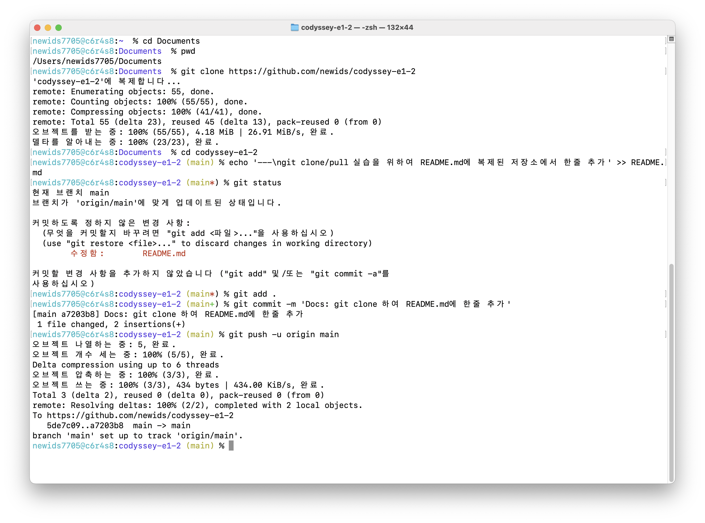

# codyssey-e1-2

# Mission 2: 컴퓨터에게 명령 내리는 말(파이썬) 처음 배우기

## 프로젝트 개요

Python 기본 문법 만을 이용하고, 클래스(객체 지향)를 사용해 만든 4지선다 퀴즈 게임
터미널에서 메뉴 출력, 문제 풀기, 문제 등록, 목록 확인, 점수 확인 등 기능
퀴즈와 점수는 `state.json` 파일에 저장되고 프로그램이 종료되어도 유지
Git으로 기능 단위 커밋과 브랜치 병합 실습

## 퀴즈 주제와 선정 이유

이 프로젝트의 주제인 파이선의 기본 문법 중에서 생성

## 실행 방법

```bash
python main.py
```

- Python 3.10 이상에서 동작
- 외부 라이브러리 없이 표준 라이브러리만 사용

## 기능 목록

| 메뉴 | 기능 | 설명 |
|---|---|---|
| 1 | 퀴즈 풀기 | 등록된 퀴즈를 랜덤 순서로 출제하고 정답/오답과 최종 점수를 표시 |
| 2 | 퀴즈 추가 | 문제, 선택지 4개, 정답 번호를 입력받아 새 퀴즈 등록 및 저장 |
| 3 | 퀴즈 목록 | 등록된 퀴즈 전체를 번호와 함께 출력 |
| 4 | 점수 확인 | 최고 점수 확인 (아직 풀지 않았으면 안내) |
| 5 | 퀴즈 삭제 | 선택한 퀴즈를 삭제 |
| 6 | 종료 | 데이터 저장 후 종료 |

- 예외 상황 처리
    - 입력 예외 상황처리 : 공백, 빈 입력, 숫자 이외, 범위 밖 숫자
    - `Ctrl-C`(KeyboardInterrupt), 입력 스트림 종료(EOF)
    - `state.json` 파일이 없는 경우 기본 데이터로 생성

- 기능 추가
  - 랜덤 출제, 문제 수 선택, 힌트, 삭제, 히스토리

## 파일 구조

```tree
codyssey-e1-2/
├── main.py        # 진입점: QuizGame 실행, Ctrl+C/EOF 안전 종료 처리
├── quiz.py        # Quiz 클래스(문제/선택지/정답) + 기본 퀴즈 데이터
├── quiz_game.py   # QuizGame 클래스(메뉴, 풀기/추가/목록/점수, 저장/불러오기)
├── state.json     # 데이터 파일 (퀴즈 목록 + 최고 점수, 실행 시 자동 생성)
├── README.md      # 프로젝트 문서
├── docs/PLAN.md   # 미션 요구 사항
└── docs/screenshots/  # 제출용 스크린샷
```

## 데이터 파일 설명 (`state.json`)

```json
{
  "quizzes": [
    {
      "question": "문제",
      "choices": ["선택지 1", "선택지 2", "선택지 3", "선택지 4"],
      "answer": 1,
      "hint": "힌트"
    }
  ],
  "best_score": 0
}
```

| 필드 | 타입 | 설명 |
|---|---|---|
| `quizzes` | 배열 | 퀴즈 목록 |
| `quizzes[].question` | 문자열 | 문제 |
| `quizzes[].choices` | 문자열 배열(4개) | 선택지 |
| `quizzes[].answer` | 정수(1~4) | 정답 번호 |
| `quizzes[].hint` | 문자열 | 힌트 |
| `best_score` | 정수 또는 null | 최고 점수(100점 만점). 아직 풀지 않았으면 null |

## 증빙

- 원격 저장소 URL 및 10개 이상 커밋 증빙(로그/스크린샷) 
- 브랜치 생성·병합 기록을 보여주는 git log/병합 스냅샷) 
- README.md > 'git clone/pull 실습을 위하여 README.md에 복제된 저장소에서 한줄 추가' 

## 평가 항목

- 클래스 장점 및 함수 대비 차이에 대한 설명(비교)
---
| 구분 | 함수 (Function) | 클래스 (Class) / 객체 (Object) |
|---|---|---|
| 중심 개념 | 행동(Action) 중심 | 상태(State) + 행동(Action) 중심 |
| 데이터 관리 | 입력값(매개변수)을 받아 처리 후 결과 반환 | 내부에 **변수(속성)**를 저장하고 상태를 계속 유지|
| 주요 목적 | 반복되는 로직이나 계산 처리 | 복잡한 데이터와 관련 기능의 구조화 |
| 메모리/인스턴스 | 호출될 때만 실행되고 종료되면 데이터 사라짐 | 설계도를 바탕으로 여러 개의 독립된 객체(인스턴스) 생성 가능 |
---
- JSON 저장 선택 이유(가독성, 경량성 등)에 대한 설명
  - 직관적 가독성
  - 가변 스키마 및 높은 유연성
  - 언어 및 플랫폼 독립성
  - 경량성 및 전송 효율성

- 브랜치와 병합의 개념적 의미(왜 브랜치를 쓰는지, 병합의 결과 등)에 대한 설명
  - 메인 줄기(기존 코드 base)에서 독립된 새로운 줄기(작업 공간)를 뻗어 나가 작업을 진행하는 메커니즘
  - 코드를 통째로 복사해서 새로 폴더를 만드는 것이 아니라, 특정 커밋(Commit)을 가리키는 가벼운 포인터(Pointer)
  - 사용 이유
    1. 안전성(독립된 작업 공간)
    2. 병렬 작업(동시 개발)
    3. 체계적인 작업 흐름(main, develop, feature, hotfix 등)
  - 병합(merge) : 별도 브랜치에서 독립적으로 진행된 작업 결과물을 하나의 브랜드로 통합
- 1000개 확장 시 성능·메모리·검색 한계에 대한 분석
  - 메모리 1000개 레코드는 500KB ~ 1MB 수준
  - 1000만개의 데이터로 확장하는 경우 문제가 될 수 있음.
  - 검색 및 조회 성능 저하
  - read/write 속도 및 안정성 저하
  - 데이터의 양이 증가하는 경우 데이터베이스 도입 필요
  
git clone/pull 실습을 위하여 README.md에 복제된 저장소에서 한줄 추가
